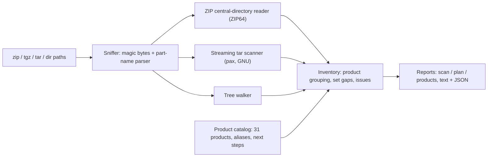

# outtake

[English](README.md) | [中文](README.zh.md) | [日本語](README.ja.md)

[](LICENSE)   [](CONTRIBUTING.md)

**Google Takeout アーカイブの棚卸しを行うオープンソース・依存ゼロのツール——中身、サイズ、フォーマット、分割パートの欠落、そして各プロダクトのデータをどうするかの具体的な次の一手まで——1 バイトも展開せずに。**


```bash
# not yet on npm — install from a checkout of this repository
git clone https://github.com/JaydenCJ/outtake.git && cd outtake
npm install && npm run build && npm pack
npm install -g ./outtake-0.1.0.tgz
```

## なぜ outtake？

Google を離れるとき手元に残るのは不透明な zip の山——多くは十数個に分割された 50 GB——で、地図はありません。Google 純正の `archive_browser.html` はまだ展開していないアーカイブの*中*にあり、`unzip -l` は一度に 1 パートしか見えず、「Google Photos」がそのうち 3 つにまたがることも、ドイツ語アカウントではフォルダ名が `Google Fotos` になることも、パート 7 のダウンロードが途中で切れたことも分かりません。プロダクト個別のツール（写真修復、mbox インポータ）は優秀ですが——それは何がどこにあるか分かった*後*の話。outtake はその欠けていた最初の一歩です。ZIP セントラルディレクトリと tar ヘッダだけを読み（50 GB のパートも数 MB の I/O で走査）、全パートを統合して全 Takeout プロダクト横断の棚卸しを作り、パートの欠落を証明し、移行プレイブックを添えます——どのアーカイブに何が入っているか、プロダクトごとの正確な `unzip` コマンド、そして各フォーマットを次にどのツールへ渡すべきかまで。

| 能力 | outtake | `unzip -l` / `tar -tzf` | archive_browser.html | プロダクト個別ツール |
|---|---|---|---|---|
| 対象範囲 | 全 Takeout プロダクト | 生のファイル一覧 | 1 回のエクスポート、閲覧のみ | 各 1 プロダクト |
| 展開せずに使える | はい——セントラルディレクトリのみ | はい | いいえ——zip の中にある | いいえ——展開済みファイルが必要 |
| 複数パートの統合 | はい、欠落の証明つき | いいえ——1 アーカイブずつ | いいえ | いいえ |
| 欠落パートの検出 | はい（`missing-part`、`--strict`） | いいえ | いいえ | いいえ |
| プロダクト別サイズ・形式 | はい | 手計算 | 部分的 | 対象外 |
| 次の一手のツール提案 | はい、プロダクトごと | いいえ | いいえ | 暗黙的 |
| ディスク計算つき展開計画 | はい（`outtake plan`） | いいえ | いいえ | いいえ |
| ランタイム依存 | 0 | プリインストール | 対象外 | まちまち |

<sub>各ツールの公開ドキュメント上の挙動（2026-07 時点）との比較。outtake はそれらプロダクトツールの出発点で終わる——plan の出力が名指しで案内します。</sub>

## 特徴

- **全プロダクト横断のトリアージ** — Photos、Mail、Drive、YouTube、Timeline、Keep、Chrome ほか 20 以上を 1 つのレポートで：ファイル数、展開後サイズ、フォーマットのヒストグラム、最大ファイル、そしてプロダクトごとの可搬性グレード（オープン標準 / 要変換 / 記録のみ）。
- **プロダクトごとの次の一手** — 既知の各プロダクトに厳選した移行アドバイスが付属：Photos のサイドカー統合の警告、mbox の Thunderbird/Maildir ルート、CardDAV/CalDAV へのインポート、Timeline の GPX 変換——バイト数だけでなくツールの地図を渡します。
- **展開しない、データを読まない** — サイズは ZIP セントラルディレクトリ（ZIP64 対応）とストリーミング tar ヘッダから取得。ファイルの中身は決して開かず、何もマシンの外へ出ません。
- **複数パートを正しく扱う** — エクスポートのタイムスタンプでパートを統合。欠落は証明され（`missing part 2 of 3`）、別エクスポートの混入は警告、ファイル名に総数がなければ完全性を正直に保留します。
- **一覧ではなく展開計画を出す** — `outtake plan --only photos,mail` が作業を順序立てる：パート補完のブロッカー、ディスク容量の計算、アーカイブ×プロダクトごとの正確な `unzip`/`tar`/`cp` コマンド、最後にセルフ検証ステップ。
- **スクリプトのための設計** — 安定スキーマタグ付き `--format json`、`--strict` の終了コード、バイト単位で決定的な出力、マジックバイト判定（拡張子を間違えた `.zip` も走査可）、ランタイム依存ゼロ。

## クイックスタート

上記の手順でインストールし、エクスポートのパートを指定します（同梱サンプルの生成も可：`node examples/make-sample.mjs sample`）：

```bash
outtake scan sample/takeout-20260412T081523Z-001.zip sample/takeout-20260412T081523Z-002.zip
```

出力（実際の実行記録、抜粋）：

```text
outtake 0.1.0 — 2 sources, 22 files, 6.5 MiB extracted (6.5 MiB on disk)

Archive set 20260412T081523Z: parts 1, 2 — no gaps seen, but total part count is unknown

Products (10)
  PRODUCT                    FILES  EXTRACTED  TOP FORMATS              PORTABILITY
  Google Photos                  9    5.6 MiB  jpg 3 · mp4 1 · json 5   high
  Drive                          3  450.5 KiB  pdf 1 · docx 1 · xlsx 1  high
  Mail                           1  417.8 KiB  mbox 1                   high
  YouTube and YouTube Music      2   56.9 KiB  json 1 · csv 1           medium
  Timeline                       1   49.8 KiB  json 1                   medium
  ...

Next steps
  Google Photos: The JSON sidecars, not the files' EXIF, hold the authoritative timestamps, ...
  Mail: Import the .mbox straight into Thunderbird (ImportExportTools NG) to browse and re-file it.
  Run `outtake plan` for the full per-product playbook.
```

続いて棚卸しを順序立てたプレイブックに変えます（実際の実行記録、抜粋）：

```bash
outtake plan sample/takeout-*.zip --only mail --dest ./extracted
```

```text
2. Extract Mail — 417.8 KiB
   Mail lives entirely in sample/takeout-20260412T081523Z-001.zip: 1 file, 417.8 KiB.
   Then:
     - Import the .mbox straight into Thunderbird (ImportExportTools NG) to browse and re-file it.
     - For a searchable archive, convert to Maildir with `mb2md` and index with notmuch or mu.
   $ unzip -n 'sample/takeout-20260412T081523Z-001.zip' 'Takeout/Mail/*' -d './extracted'

3. Verify the extraction
   $ outtake scan './extracted'
```

展開済みディレクトリも同じように走査できます：`outtake scan ~/Takeout`。その他のシナリオは [examples/](examples/README.md) を参照。

## CLI リファレンス

`outtake scan` は棚卸し、`outtake plan` は展開の段取り、`outtake products [id]` はカタログ表示。3 コマンドとも `--format json` を受け付けます（安定形状：`outtake/scan@1`、`outtake/plan@1`、`outtake/products@1`）。

| フラグ | 既定値 | 効果 |
|---|---|---|
| `--format text\|json` | `text` | レポート形式。JSON はスクリプト向けの安定形状 |
| `--sort size\|files\|name` | `size` | scan 出力でのプロダクトの並び順 |
| `--top N` | `5` | 一覧する最大ファイル数（`0` でセクション非表示） |
| `--only IDS` | 全部 | plan：カンマ区切りのプロダクト id またはフォルダ名 |
| `--dest DIR` | `./takeout-extracted` | plan：コマンドに使う展開先 |
| `--strict` | オフ | scan：問題（欠落パート、未知フォルダ…）があれば 1 で終了 |

終了コード：`0` 正常、`1` は `--strict` 下での問題検出、`2` は用法エラーまたは読めない/壊れたアーカイブ——スクリプトが「不完全なエクスポート」と「打ち間違い」を区別できます。

## プロダクトカタログ

`outtake products` は 31 の Takeout プロダクトの知識を内蔵：正規フォルダ名、旧称・ローカライズ別名（`Hangouts` → Google Chat、`Google Fotos` → Google Photos）、想定フォーマット、可搬性グレード、順序付きの次の一手。識別できないフォルダは保持・計量のうえ `unknown-product` として警告——決して推測しません。レイアウトの詳細と落とし穴（サイドカー、ローカライズ、途中で切れたダウンロード）は [docs/takeout-layout.md](docs/takeout-layout.md) に記載。

| グレード | 意味 | 例 |
|---|---|---|
| `high` | オープン形式、どこへでもインポート可 | Mail（mbox）、Contacts（vCard）、Calendar（iCS）、Photos（メディア + JSON） |
| `medium` | 文書化された JSON/CSV、変換器が必要 | Timeline、Keep、YouTube、Fit、Chrome |
| `low` | 読める記録、ほぼインポート不可 | Tasks、Play Store、Profile、Google Account |

## アーキテクチャ



## ロードマップ

- [x] 31 プロダクト横断スキャン、ZIP64 + tgz + ディレクトリ入力、パート欠落の証明、展開計画、JSON 出力（v0.1.0）
- [ ] ローカライズ済みフォルダ別名の拡充（fr、es、pt、ko）——実エクスポート由来
- [ ] scan 出力の `--min-size` / `--product` フィルタ
- [ ] Google Photos のサイドカー網羅チェック（JSON を欠くメディアファイル）
- [ ] ダウンロード済みパートの任意 CRC 検証

全リストは [open issues](https://github.com/JaydenCJ/outtake/issues) を参照。

## コントリビュート

コントリビュート歓迎——実エクスポート由来のローカライズ済みフォルダ名は特に貴重です。`npm install && npm run build` でビルドし、`npm test`（92 テスト）と `bash scripts/smoke.sh`（`SMOKE OK` の出力必須）を実行——本リポジトリは CI を持たず、上記の主張はすべてローカル実行で検証しています。[CONTRIBUTING.md](CONTRIBUTING.md) を読み、[good first issue](https://github.com/JaydenCJ/outtake/issues?q=is%3Aissue+is%3Aopen+label%3A%22good+first+issue%22) を選ぶか、[discussion](https://github.com/JaydenCJ/outtake/discussions) を始めてください。

## ライセンス

[MIT](LICENSE)
