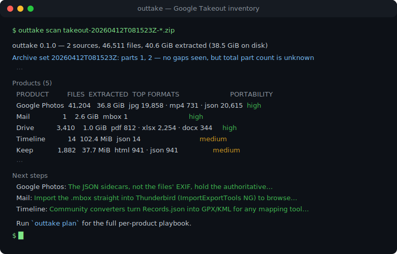
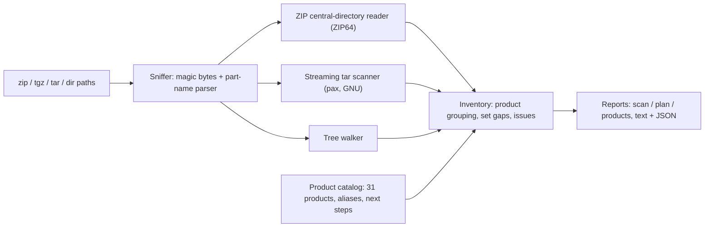

# outtake

[English](README.md) | [中文](README.zh.md) | [日本語](README.ja.md)

[](LICENSE)   [](CONTRIBUTING.md)

**An open-source, zero-dependency inventory tool for Google Takeout archives — what's inside, how big, in which formats, whether parts are missing, and the concrete next step for every product — without extracting a single byte.**



```bash
# not yet on npm — install from a checkout of this repository
git clone https://github.com/JaydenCJ/outtake.git && cd outtake
npm install && npm run build && npm pack
npm install -g ./outtake-0.1.0.tgz
```

## Why outtake?

Leaving Google hands you a pile of opaque zips — often 50 GB split into a dozen numbered parts — and no map. Google's own `archive_browser.html` sits *inside* the archive you haven't extracted yet; `unzip -l` shows one part at a time with no idea that "Google Photos" spans three of them, that the folder is called `Google Fotos` on a German account, or that part 7 never finished downloading. Product-specific tools (photo fixers, mbox importers) are great — *after* you know what you have and where. outtake is the missing first step: it reads only the ZIP central directories and tar headers (a 50 GB part costs a few MB of I/O), merges all parts into one umbrella inventory across every Takeout product, proves part-set gaps, and attaches a migration playbook — which archive holds what, the exact `unzip` command per product, and which tool to feed each format to next.

| Capability | outtake | `unzip -l` / `tar -tzf` | archive_browser.html | product-specific tools |
|---|---|---|---|---|
| Scope | every Takeout product | raw file listing | one export, browse-only | one product each |
| Works without extracting | yes — central directory only | yes | no — it is inside the zip | no — need extracted files |
| Merges multi-part sets | yes, with gap proofs | no — one archive at a time | no | no |
| Missing-part detection | yes (`missing-part`, `--strict`) | no | no | no |
| Per-product sizes and formats | yes | manual arithmetic | partial | n/a |
| Next-step tooling advice | yes, per product | no | no | implicit |
| Extraction plan with disk math | yes (`outtake plan`) | no | no | no |
| Runtime dependencies | 0 | preinstalled | n/a | varies |

<sub>Comparison against each tool's documented behavior, 2026-07. outtake ends where those product tools begin — its plan output names them.</sub>

## Features

- **Umbrella triage across all products** — one report covering Photos, Mail, Drive, YouTube, Timeline, Keep, Chrome and 20+ more: file counts, extracted sizes, format histograms, largest files, and a portability grade (open standard / needs conversion / record-only) per product.
- **Per-product next steps** — every known product carries curated migration advice: sidecar-merge warnings for Photos, Thunderbird/Maildir routes for the mbox, CardDAV/CalDAV imports, GPX converters for Timeline — the tooling map, not just the byte count.
- **No extraction, no reading your data** — sizes come from ZIP central directories (ZIP64 included) and streamed tar headers; file contents are never opened, and nothing ever leaves your machine.
- **Multi-part sets done right** — parts are merged by export stamp; gaps are proven (`missing part 2 of 3`), mixed exports are flagged, and completeness is reported honestly when the filename carries no total.
- **An extraction plan, not just a listing** — `outtake plan --only photos,mail` orders the work: complete-the-set blockers, disk-space math, the exact `unzip`/`tar`/`cp` command per product per archive, then a self-verification step.
- **Built for scripting** — `--format json` with stable schema tags, `--strict` exit codes, deterministic byte-identical output, magic-byte sniffing (a mislabeled `.zip` still scans), zero runtime dependencies.

## Quickstart

Install as above, then point it at your export parts (or generate the bundled sample: `node examples/make-sample.mjs sample`):

```bash
outtake scan sample/takeout-20260412T081523Z-001.zip sample/takeout-20260412T081523Z-002.zip
```

Output (real captured run, abridged):

```text
outtake 0.1.0 — 2 sources, 22 files, 6.5 MiB extracted (6.5 MiB on disk)

Archive set 20260412T081523Z: parts 1, 2 — no gaps seen, but total part count is unknown

Products (10)
  PRODUCT                    FILES  EXTRACTED  TOP FORMATS              PORTABILITY
  Google Photos                  9    5.6 MiB  jpg 3 · mp4 1 · json 5   high
  Drive                          3  450.5 KiB  pdf 1 · docx 1 · xlsx 1  high
  Mail                           1  417.8 KiB  mbox 1                   high
  YouTube and YouTube Music      2   56.9 KiB  json 1 · csv 1           medium
  Timeline                       1   49.8 KiB  json 1                   medium
  ...

Next steps
  Google Photos: The JSON sidecars, not the files' EXIF, hold the authoritative timestamps, ...
  Mail: Import the .mbox straight into Thunderbird (ImportExportTools NG) to browse and re-file it.
  Run `outtake plan` for the full per-product playbook.
```

Then turn the inventory into an ordered playbook (real captured run, abridged):

```bash
outtake plan sample/takeout-*.zip --only mail --dest ./extracted
```

```text
2. Extract Mail — 417.8 KiB
   Mail lives entirely in sample/takeout-20260412T081523Z-001.zip: 1 file, 417.8 KiB.
   Then:
     - Import the .mbox straight into Thunderbird (ImportExportTools NG) to browse and re-file it.
     - For a searchable archive, convert to Maildir with `mb2md` and index with notmuch or mu.
   $ unzip -n 'sample/takeout-20260412T081523Z-001.zip' 'Takeout/Mail/*' -d './extracted'

3. Verify the extraction
   $ outtake scan './extracted'
```

Already-extracted directories scan the same way: `outtake scan ~/Takeout`. More scenarios live in [examples/](examples/README.md).

## CLI reference

`outtake scan` inventories, `outtake plan` orders the extraction, `outtake products [id]` prints the catalog. All three accept `--format json` (stable shapes: `outtake/scan@1`, `outtake/plan@1`, `outtake/products@1`).

| Flag | Default | Effect |
|---|---|---|
| `--format text\|json` | `text` | report format; JSON is a stable shape for scripting |
| `--sort size\|files\|name` | `size` | product ordering in scan output |
| `--top N` | `5` | largest files to list (`0` hides the section) |
| `--only IDS` | all | plan: comma-separated product ids or folder names |
| `--dest DIR` | `./takeout-extracted` | plan: extraction destination used in commands |
| `--strict` | off | scan: any issue (missing part, unknown folder, …) exits 1 |

Exit codes: `0` clean, `1` issues under `--strict`, `2` usage error or unreadable/broken archive — so scripts can tell an incomplete export from a broken invocation.

## The product catalog

`outtake products` ships knowledge of 31 Takeout products: canonical folder name, legacy and localized aliases (`Hangouts` → Google Chat, `Google Fotos` → Google Photos), expected formats, a portability grade, and ordered next steps. Folders it cannot identify are kept, sized, and flagged `unknown-product` — never guessed. Layout details and the sharp edges (sidecars, localization, truncated downloads) are documented in [docs/takeout-layout.md](docs/takeout-layout.md).

| Grade | Meaning | Examples |
|---|---|---|
| `high` | open formats, import anywhere | Mail (mbox), Contacts (vCard), Calendar (iCS), Photos (media + JSON) |
| `medium` | documented JSON/CSV, needs a converter | Timeline, Keep, YouTube, Fit, Chrome |
| `low` | readable record, rarely importable | Tasks, Play Store, Profile, Google Account |

## Architecture



## Roadmap

- [x] Umbrella scan across 31 products, ZIP64 + tgz + dir sources, part-set gap proofs, extraction plans, JSON output (v0.1.0)
- [ ] More localized folder aliases (fr, es, pt, ko) sourced from real exports
- [ ] `--min-size` / `--product` filters on scan output
- [ ] Sidecar coverage check for Google Photos (media files missing their JSON)
- [ ] Optional CRC verification pass for downloaded parts

See the [open issues](https://github.com/JaydenCJ/outtake/issues) for the full list.

## Contributing

Contributions are welcome — localized folder names from real exports are especially valuable. Build with `npm install && npm run build`, then run `npm test` (92 tests) and `bash scripts/smoke.sh` (must print `SMOKE OK`) — this repository ships no CI, every claim above is verified by local runs. See [CONTRIBUTING.md](CONTRIBUTING.md), grab a [good first issue](https://github.com/JaydenCJ/outtake/issues?q=is%3Aissue+is%3Aopen+label%3A%22good+first+issue%22), or start a [discussion](https://github.com/JaydenCJ/outtake/discussions).

## License

[MIT](LICENSE)
