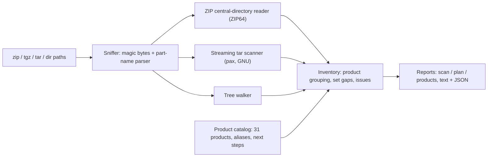

# outtake

[English](README.md) | [中文](README.zh.md) | [日本語](README.ja.md)

[](LICENSE)   [](CONTRIBUTING.md)

**一个开源、零依赖的 Google Takeout 归档清点工具——里面有什么、多大、什么格式、缺不缺分卷，以及每个产品数据的下一步具体做法——全程不解压一个字节。**


```bash
# not yet on npm — install from a checkout of this repository
git clone https://github.com/JaydenCJ/outtake.git && cd outtake
npm install && npm run build && npm pack
npm install -g ./outtake-0.1.0.tgz
```

## 为什么选 outtake？

离开 Google 时，你拿到的是一堆不透明的 zip——常常是拆成十几个分卷的 50 GB——却没有一张地图。Google 自带的 `archive_browser.html` 就躺在你还没解压的归档*里面*；`unzip -l` 一次只能看一个分卷，既不知道 "Google Photos" 横跨其中三个，也不知道德语账号的文件夹叫 `Google Fotos`，更不知道第 7 卷根本没下载完。各产品的专用工具（照片修复器、mbox 导入器）都很好——但那是在你弄清自己有什么、在哪之*后*。outtake 补上缺失的第一步：它只读 ZIP 中央目录和 tar 头（扫一个 50 GB 分卷只花几 MB 的 I/O），把所有分卷合并成一份覆盖全部 Takeout 产品的总览清单，证明分卷缺口，并附上迁移手册——哪个归档装着什么、每个产品对应的 `unzip` 命令，以及每种格式接下来该喂给哪个工具。

| 能力 | outtake | `unzip -l` / `tar -tzf` | archive_browser.html | 各产品专用工具 |
|---|---|---|---|---|
| 覆盖范围 | 全部 Takeout 产品 | 原始文件列表 | 单次导出，仅浏览 | 各管一个产品 |
| 无需解压即可用 | 是——只读中央目录 | 是 | 否——它在 zip 里面 | 否——需要已解压文件 |
| 合并多分卷集合 | 是，并证明缺口 | 否——一次一个归档 | 否 | 否 |
| 缺卷检测 | 是（`missing-part`、`--strict`） | 否 | 否 | 否 |
| 按产品的大小与格式 | 是 | 手工算 | 部分 | 不适用 |
| 下一步工具建议 | 是，按产品 | 否 | 否 | 隐含 |
| 带磁盘核算的解压计划 | 是（`outtake plan`） | 否 | 否 | 否 |
| 运行时依赖 | 0 | 系统自带 | 不适用 | 各不相同 |

<sub>对比基于各工具截至 2026-07 的公开文档行为。outtake 止于那些产品工具的起点——它的计划输出会点名它们。</sub>

## 功能

- **全产品统一分诊** — 一份报告覆盖 Photos、Mail、Drive、YouTube、Timeline、Keep、Chrome 及另外 20 多个产品：文件数、解压后大小、格式直方图、最大文件，以及每个产品的可移植性等级（开放标准 / 需转换 / 仅存档）。
- **按产品的下一步** — 每个已知产品都带着精选迁移建议：Photos 的 sidecar 合并警告、mbox 的 Thunderbird/Maildir 路线、CardDAV/CalDAV 导入、Timeline 的 GPX 转换器——给的是工具地图，不只是字节数。
- **不解压、不读你的数据** — 大小来自 ZIP 中央目录（含 ZIP64）和流式 tar 头；从不打开文件内容，任何东西都不会离开你的机器。
- **把多分卷做对** — 按导出时间戳合并分卷；缺口可证明（`missing part 2 of 3`），混入别的导出会被标记，文件名不带总数时对完整性如实存疑。
- **给的是解压计划，不只是列表** — `outtake plan --only photos,mail` 排好工序：先补齐分卷的阻塞项、磁盘空间核算、每个产品在每个归档上的确切 `unzip`/`tar`/`cp` 命令，最后一步自我校验。
- **为脚本而生** — 带稳定 schema 标签的 `--format json`、`--strict` 退出码、字节级确定性输出、按魔数嗅探（改错扩展名的 `.zip` 照样能扫）、零运行时依赖。

## 快速上手

按上文安装，然后指向你的导出分卷（或生成自带样例：`node examples/make-sample.mjs sample`）：

```bash
outtake scan sample/takeout-20260412T081523Z-001.zip sample/takeout-20260412T081523Z-002.zip
```

输出（真实运行记录，有删节）：

```text
outtake 0.1.0 — 2 sources, 22 files, 6.5 MiB extracted (6.5 MiB on disk)

Archive set 20260412T081523Z: parts 1, 2 — no gaps seen, but total part count is unknown

Products (10)
  PRODUCT                    FILES  EXTRACTED  TOP FORMATS              PORTABILITY
  Google Photos                  9    5.6 MiB  jpg 3 · mp4 1 · json 5   high
  Drive                          3  450.5 KiB  pdf 1 · docx 1 · xlsx 1  high
  Mail                           1  417.8 KiB  mbox 1                   high
  YouTube and YouTube Music      2   56.9 KiB  json 1 · csv 1           medium
  Timeline                       1   49.8 KiB  json 1                   medium
  ...

Next steps
  Google Photos: The JSON sidecars, not the files' EXIF, hold the authoritative timestamps, ...
  Mail: Import the .mbox straight into Thunderbird (ImportExportTools NG) to browse and re-file it.
  Run `outtake plan` for the full per-product playbook.
```

再把清单变成一份有序手册（真实运行记录，有删节）：

```bash
outtake plan sample/takeout-*.zip --only mail --dest ./extracted
```

```text
2. Extract Mail — 417.8 KiB
   Mail lives entirely in sample/takeout-20260412T081523Z-001.zip: 1 file, 417.8 KiB.
   Then:
     - Import the .mbox straight into Thunderbird (ImportExportTools NG) to browse and re-file it.
     - For a searchable archive, convert to Maildir with `mb2md` and index with notmuch or mu.
   $ unzip -n 'sample/takeout-20260412T081523Z-001.zip' 'Takeout/Mail/*' -d './extracted'

3. Verify the extraction
   $ outtake scan './extracted'
```

已解压的目录同样能扫：`outtake scan ~/Takeout`。更多场景见 [examples/](examples/README.md)。

## CLI 参考

`outtake scan` 清点，`outtake plan` 编排解压，`outtake products [id]` 打印目录。三者都接受 `--format json`（稳定形状：`outtake/scan@1`、`outtake/plan@1`、`outtake/products@1`）。

| 选项 | 默认值 | 效果 |
|---|---|---|
| `--format text\|json` | `text` | 报告格式；JSON 为脚本提供稳定形状 |
| `--sort size\|files\|name` | `size` | scan 输出中的产品排序 |
| `--top N` | `5` | 列出的最大文件数量（`0` 隐藏该节） |
| `--only IDS` | 全部 | plan：逗号分隔的产品 id 或文件夹名 |
| `--dest DIR` | `./takeout-extracted` | plan：命令中使用的解压目标 |
| `--strict` | 关 | scan：任何问题（缺卷、未知文件夹…）都以 1 退出 |

退出码：`0` 干净，`1` 是 `--strict` 下发现问题，`2` 是用法错误或归档不可读/损坏——脚本因此能区分"导出不完整"和"命令敲错了"。

## 产品目录

`outtake products` 内置 31 个 Takeout 产品的知识：规范文件夹名、历史与本地化别名（`Hangouts` → Google Chat、`Google Fotos` → Google Photos）、预期格式、可移植性等级和有序的下一步。认不出的文件夹会被保留、计量并标记为 `unknown-product`——绝不瞎猜。布局细节和那些坑（sidecar、本地化、下载截断）记录在 [docs/takeout-layout.md](docs/takeout-layout.md)。

| 等级 | 含义 | 例子 |
|---|---|---|
| `high` | 开放格式，随处可导入 | Mail（mbox）、Contacts（vCard）、Calendar（iCS）、Photos（媒体 + JSON） |
| `medium` | 有文档的 JSON/CSV，需要转换器 | Timeline、Keep、YouTube、Fit、Chrome |
| `low` | 可读的记录，基本无处可导入 | Tasks、Play Store、Profile、Google Account |

## 架构



## 路线图

- [x] 覆盖 31 个产品的统一扫描、ZIP64 + tgz + 目录输入、分卷缺口证明、解压计划、JSON 输出（v0.1.0）
- [ ] 更多本地化文件夹别名（fr、es、pt、ko），取自真实导出
- [ ] scan 输出的 `--min-size` / `--product` 过滤器
- [ ] Google Photos 的 sidecar 覆盖率检查（缺 JSON 的媒体文件）
- [ ] 已下载分卷的可选 CRC 校验

完整列表见 [open issues](https://github.com/JaydenCJ/outtake/issues)。

## 参与贡献

欢迎贡献——来自真实导出的本地化文件夹名尤其宝贵。用 `npm install && npm run build` 构建，然后跑 `npm test`（92 个测试）和 `bash scripts/smoke.sh`（必须打印 `SMOKE OK`）——本仓库不带 CI，上面的每条主张都由本地运行验证。参阅 [CONTRIBUTING.md](CONTRIBUTING.md)，认领一个 [good first issue](https://github.com/JaydenCJ/outtake/issues?q=is%3Aissue+is%3Aopen+label%3A%22good+first+issue%22)，或发起一场 [discussion](https://github.com/JaydenCJ/outtake/discussions)。

## 许可证

[MIT](LICENSE)
